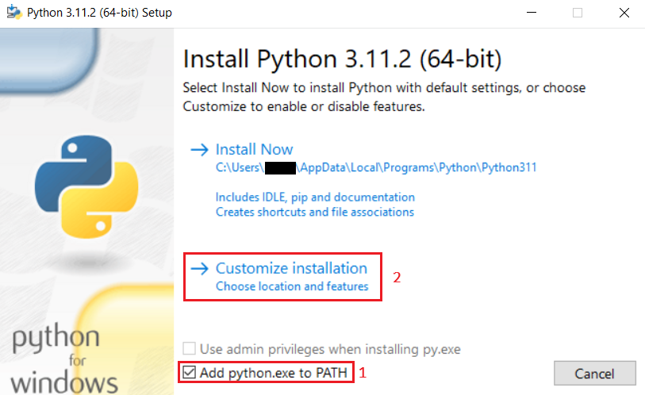
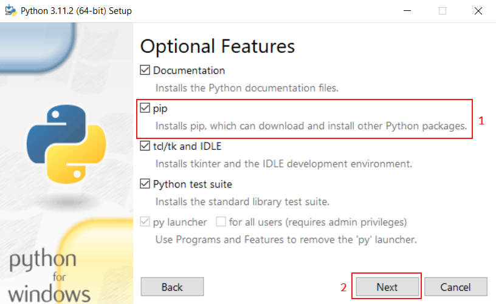
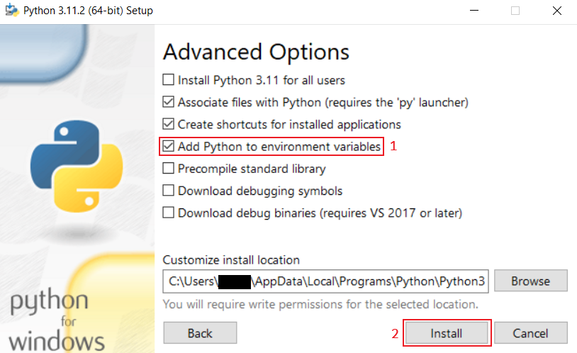
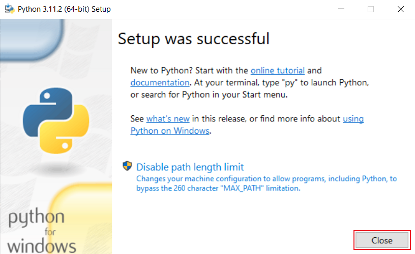

# Interpreted language
That programming language was published as **public** at 03/01/2023. This is interpreted programming language which meaning that source code **can run as is**

(C) Egor Chernov. All rights reversed.
## How to use?
### Linux
- Open terminal using <kbd>Ctrl</kbd> <kbd>Alt</kbd> <kbd>T</kbd> and type in prompt
    ```sh
    python3 shell.py
    ```
### Windows
#### Python installation
- Download Python installer at official [website](https://python.org/)
- Install Python with that tutorial

[](con/img/github_tutorial_windows.png)

[](con/img/github_tutorial_windows2.png)

[](con/img/github_tutorial_windows3.png)

[](con/img/github_tutorial_windows4.png)
#### Run sh6
- Press <kbd>Win</kbd> <kbd>R</kbd>
- Type "cmd"
- Press <kbd>Enter</kbd>
- Go into directory of sh6
- Type in command prompt 
    ```bat
    python shell.py
    ```
## Questions nobody ask
Q: Is this software proprietary?

A: No, It's free to use and to change! :)
